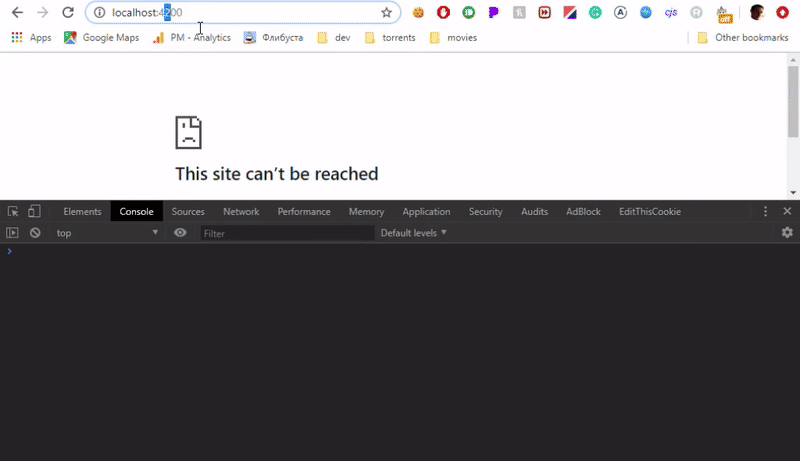

## ⚡ Part 5 of 6: Improve Performance with TransferState

If we run our app in its current state and take a look at the network tab of the Browser Developer Tools, we'll see that after initial load the app will make a request to load the JSON file for the currently selected language.

This does not make much sense since we've already loaded the appropriate language in the server.

Making an extra request to load language translations that are already loaded might seem like it's not a big issue worth solving. There are probably areas of an application that will result in a bigger bang for the buck in terms of performance tuning. See [this article](https://christianlydemann.com/the-complete-guide-to-angular-load-time-optimization/) for more on this topic. However, for bigger applications, translation files might also get bigger. Therefore, the time to download and process them will also increase, at which point this would be an issue to solve.

Thankfully, Angular Universal provides a tool to solve this issue with relatively little effort: `[TransferState](https://angular.io/api/platform-browser/TransferState)`. When this solution in use, the server will embed the data with the initial HTML sent to the client. The client will then be able to read this data without the need to ask the server.

### Overview of the Workflow

To make use of the TransferState feature, we need to:
1. Add the module provided by Angular for the server and for the client: `ServerTransferStateModule` and `BrowserTransferStateModule`
2. On the server: set the data that we want to transfer under a specific key using API: `transferState.set(key, value)`
3. On the client: retrieve the data using API: `transferState.get(key, defaultValue)`

### Our implementation
First, let's add the TransferState Modules to the imports:
```ts
import { BrowserTransferStateModule, TransferState } from '@angular/platform-browser';

@NgModule({
  imports: [
    BrowserTransferStateModule, // ADDED
    // ...
  ]
})
export class I18nModule {
  // ...
}
```
```ts
import { ServerTransferStateModule } from '@angular/platform-server';

@NgModule({
  imports: [
    ServerTransferStateModule, // ADDED
    // ...
  ],
  bootstrap: [AppComponent],
})
export class AppServerModule { }
```

Now let's make appropriate changes to the `I18nModule`. The snippet below shows the new code.

```ts
// ADDED needed imports from @angular
import { makeStateKey, TransferState } from '@angular/platform-browser';

@NgModule({
  imports: [
    TranslateModule.forRoot({
      loader: {
        provide: TranslateLoader,
        useFactory: translateLoaderFactory,
        deps: [HttpClient, TransferState, PLATFORM_ID] // ADDED: dependency for the factory func
      }
    })
  ]
})
export class I18nModule {
  // ...
}
```

Second, the `translateLoaderFactory` will now look like this:

```ts
export function translateLoaderFactory(httpClient: HttpClient, transferState: TransferState, platform: any) {
  return isPlatformBrowser(platform)
    ? new TranslateHttpLoader(httpClient)
    : new TranslateFSLoader(transferState);
}
```

TranslateFSLoader will now make use of TransferState:

```ts
import { makeStateKey, TransferState } from '@angular/platform-browser';

export class TranslateFSLoader implements TranslateLoader {
  constructor(
    // ADDED: inject the transferState service
    private transferState: TransferState,
    private prefix = 'i18n',
    private suffix = '.json'
  ) { }

  public getTranslation(lang: string): Observable<any> {
    const path = join(__dirname, '../browser/assets/', this.prefix, `${lang}${this.suffix}`);
    const data = JSON.parse(readFileSync(path, 'utf8'));
    // ADDED: store the translations in the transfer state:
    const key = makeStateKey<any>('transfer-translate-' + lang);
    this.transferState.set(key, data);
    return of(data);
  }
}
```

How does it exactly transfer the state? During the server-side rendering, the framework will include the data in the HTML `<script>` tag. See this in the image below.



Once the client-side bundle bootstraps, it will be able to access this data

Now we need to allow the client-side Loader to make use of the transferred data. Currently, our loader factory function simply returns the `TranslateHttpLoader`. We'll have to create a custom loader that will also be capable of handling the transfer state.

Let's create a new file to hold the custom loader class. The new loader will look like the one below.

```ts
export class TranslateBrowserLoader implements TranslateLoader {
  constructor(
    private transferState: TransferState,
    private http: HttpClient,
    private prefix: string = 'i18n',
    private suffix: string = '.json',
  ) { }
  
  public getTranslation(lang: string): Observable<any> {
    const key = makeStateKey<any>('transfer-translate-' + lang);
    const data = this.transferState.get(key, null);

    // First we are looking for the translations in transfer-state, if none found, http load as fallback
    return data
      ? of(data)
      : new TranslateHttpLoader(this.http, this.prefix, this.suffix).getTranslation(lang);
  }
}
```
 Update the `translateLoaderFactory` to use the new Loader:

 ```ts
 export function translateLoaderFactory(httpClient: HttpClient, transferState: TransferState, platform: any) {
  return isPlatformBrowser(platform)
    ? new TranslateBrowserLoader(transferState, httpClient) // <- Changed
    : new TranslateFSLoader(transferState);
}
 ```

## TransferState Summary

Using TransferState allowed us to avoid loading data from the browser that was already loaded on the server. 
Now, if we run the application we'll see that there is no unneeded request to the JSON file for the currently selected language in the network tab.

*** The code up to this point is available [here](https://github.com/DmitryEfimenko/ssr-with-i18n/tree/step-5).

